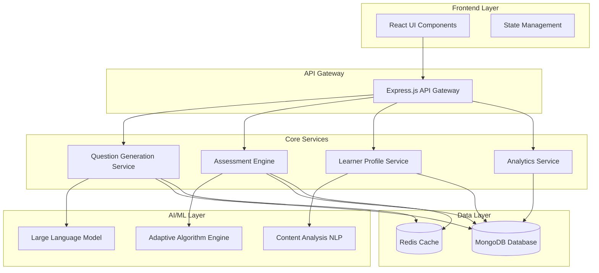

# Dynamic MCQ System Design Document

## Overview

The Dynamic MCQ System is designed using the MERN stack (MongoDB, Express.js, React.js, Node.js) to provide adaptive, personalized multiple-choice question generation and assessment. The system leverages MongoDB for flexible document storage, Express.js for RESTful APIs, React.js for dynamic user interfaces, and Node.js for server-side processing with AI/ML integration.

## Architecture

### High-Level Architecture



### Service Architecture

The system follows a microservices pattern with the following core services:

1. **Question Generation Service**: Handles AI-powered question creation and variation
2. **Assessment Engine**: Manages question delivery, scoring, and adaptive logic
3. **Learner Profile Service**: Maintains individual learner profiles and performance history
4. **Analytics Service**: Processes learning data and generates insights

## Components and Interfaces

### Frontend Components

#### MCQ Interface Component
```typescript
interface MCQProps {
  questionId: string;
  question: string;
  options: string[];
  category: string[];
  difficulty: number;
  onAnswer: (answer: string) => void;
  showHint?: boolean;
}
```

#### Progress Dashboard Component
```typescript
interface ProgressDashboardProps {
  learnerId: string;
  timeRange: 'week' | 'month' | 'all';
  categories: CategoryProgress[];
  overallProgress: OverallProgress;
}
```

#### Adaptive Quiz Component
```typescript
interface AdaptiveQuizProps {
  topic: string;
  targetDifficulty?: number;
  questionCount: number;
  onComplete: (results: QuizResults) => void;
}
```

### Backend API Interfaces

#### Question Generation API
```typescript
// POST /api/questions/generate
interface GenerateQuestionRequest {
  topic: string;
  category: string[];
  difficulty: number;
  learnerId: string;
  excludeQuestionIds?: string[];
}

interface GenerateQuestionResponse {
  questionId: string;
  question: string;
  options: string[];
  correctAnswer: string;
  explanation: string;
  category: string[];
  difficulty: number;
  hints: string[];
}
```

#### Assessment API
```typescript
// POST /api/assessment/submit
interface SubmitAnswerRequest {
  questionId: string;
  learnerId: string;
  selectedAnswer: string;
  timeSpent: number;
}

interface SubmitAnswerResponse {
  correct: boolean;
  explanation: string;
  nextDifficulty: number;
  categoryWeakness?: string[];
  recommendedResources?: Resource[];
}
```

#### Learner Profile API
```typescript
// GET /api/profile/{learnerId}
interface LearnerProfile {
  learnerId: string;
  knowledgeMap: Map<string, number>; // category -> mastery level
  weakAreas: string[];
  strongAreas: string[];
  learningPreferences: LearningPreferences;
  performanceHistory: PerformanceRecord[];
}
```

## Data Models

### Question Model (MongoDB Schema)
```javascript
const questionSchema = new mongoose.Schema({
  _id: { type: mongoose.Schema.Types.ObjectId, auto: true },
  content: { type: String, required: true },
  options: [{ type: String, required: true }],
  correctAnswer: { type: String, required: true },
  explanation: { type: String, required: true },
  category: [{ type: String, required: true }], // hierarchical: ["Math", "Algebra", "Linear Equations"]
  difficulty: { type: Number, min: 1, max: 10, required: true },
  tags: [{ type: String }],
  createdAt: { type: Date, default: Date.now },
  generatedBy: { type: String, enum: ['AI', 'Human'], required: true },
  validationScore: { type: Number, min: 0, max: 1 }
});
```

### Learner Performance Model (MongoDB Schema)
```javascript
const performanceSchema = new mongoose.Schema({
  _id: { type: mongoose.Schema.Types.ObjectId, auto: true },
  learnerId: { type: mongoose.Schema.Types.ObjectId, ref: 'Learner', required: true },
  questionId: { type: mongoose.Schema.Types.ObjectId, ref: 'Question', required: true },
  selectedAnswer: { type: String, required: true },
  correct: { type: Boolean, required: true },
  timeSpent: { type: Number, required: true }, // in seconds
  hintsUsed: { type: Number, default: 0 },
  timestamp: { type: Date, default: Date.now },
  difficulty: { type: Number, min: 1, max: 10, required: true },
  category: [{ type: String, required: true }]
});
```

### Learner Profile Model (MongoDB Schema)
```javascript
const learnerSchema = new mongoose.Schema({
  _id: { type: mongoose.Schema.Types.ObjectId, auto: true },
  email: { type: String, required: true, unique: true },
  name: { type: String, required: true },
  categoryMastery: {
    type: Map,
    of: {
      level: { type: Number, min: 0, max: 100, default: 0 },
      confidence: { type: Number, min: 0, max: 1, default: 0 },
      lastAssessed: { type: Date, default: Date.now },
      questionsAnswered: { type: Number, default: 0 },
      averageAccuracy: { type: Number, min: 0, max: 1, default: 0 }
    }
  },
  difficultyPreference: { type: Number, min: 1, max: 10, default: 5 },
  learningVelocity: { type: Number, default: 1.0 },
  retentionRate: { type: Number, min: 0, max: 1, default: 0.8 },
  lastActive: { type: Date, default: Date.now },
  createdAt: { type: Date, default: Date.now }
});
```

### Spaced Repetition Model (MongoDB Schema)
```javascript
const spacedRepetitionSchema = new mongoose.Schema({
  _id: { type: mongoose.Schema.Types.ObjectId, auto: true },
  questionId: { type: mongoose.Schema.Types.ObjectId, ref: 'Question', required: true },
  learnerId: { type: mongoose.Schema.Types.ObjectId, ref: 'Learner', required: true },
  nextReviewDate: { type: Date, required: true },
  interval: { type: Number, default: 1 }, // days
  easeFactor: { type: Number, default: 2.5 },
  repetitions: { type: Number, default: 0 },
  lastReviewed: { type: Date, default: Date.now }
});
```

## Error Handling

### Question Generation Errors
- **AI Service Unavailable**: Fallback to curated question bank
- **Invalid Topic**: Return error with suggested valid topics
- **Generation Timeout**: Return cached similar questions
- **Content Validation Failure**: Regenerate with stricter parameters

### Assessment Errors
- **Invalid Answer Submission**: Validate and return specific error
- **Profile Update Failure**: Queue for retry with exponential backoff
- **Analytics Processing Error**: Log error but don't block user experience

### Data Consistency
- **Profile Sync Issues**: Implement eventual consistency with conflict resolution
- **Question Duplication**: Use content hashing to detect and prevent duplicates
- **Performance Data Loss**: Implement write-ahead logging for critical data

## Testing Strategy

### Unit Testing
- **Question Generation Logic**: Test AI prompt engineering and response parsing
- **Adaptive Algorithms**: Test difficulty adjustment and category analysis
- **Spaced Repetition**: Test interval calculations and scheduling
- **Profile Management**: Test knowledge map updates and mastery calculations

### Integration Testing
- **API Endpoints**: Test all REST endpoints with various input scenarios
- **Database Operations**: Test CRUD operations and data consistency
- **AI Service Integration**: Test LLM integration with mock and real responses
- **Cache Layer**: Test Redis integration and cache invalidation

### End-to-End Testing
- **Complete Learning Flow**: Test from question generation to progress tracking
- **Adaptive Behavior**: Test system adaptation over multiple question sessions
- **Performance Under Load**: Test system behavior with concurrent users
- **Data Migration**: Test profile and performance data migration scenarios

### AI/ML Testing
- **Question Quality**: Implement automated quality scoring for generated questions
- **Bias Detection**: Test for educational bias in question generation
- **Difficulty Calibration**: Validate difficulty scoring against human assessment
- **Content Accuracy**: Implement fact-checking for generated content

## Implementation Considerations

### AI/ML Integration
- **LLM Selection**: Use OpenAI GPT-4 or similar for question generation
- **Prompt Engineering**: Develop specialized prompts for different question types
- **Content Validation**: Implement multi-layer validation for generated content
- **Model Fine-tuning**: Consider fine-tuning on educational content for better results

### Performance Optimization
- **Caching Strategy**: Cache frequently requested questions and profiles
- **Database Indexing**: Optimize queries with proper indexing on category and difficulty
- **Lazy Loading**: Load question explanations and hints on demand
- **CDN Integration**: Cache static educational resources

### Scalability
- **Horizontal Scaling**: Design services to scale independently
- **MongoDB Scaling**: Use MongoDB sharding and replica sets for better performance
- **Queue Management**: Use message queues for async processing of analytics
- **Load Balancing**: Implement load balancing for AI service calls

### Security and Privacy
- **Data Encryption**: Encrypt sensitive learner performance data
- **API Authentication**: Implement JWT-based authentication
- **Rate Limiting**: Prevent abuse of AI generation endpoints
- **GDPR Compliance**: Implement data deletion and export capabilities